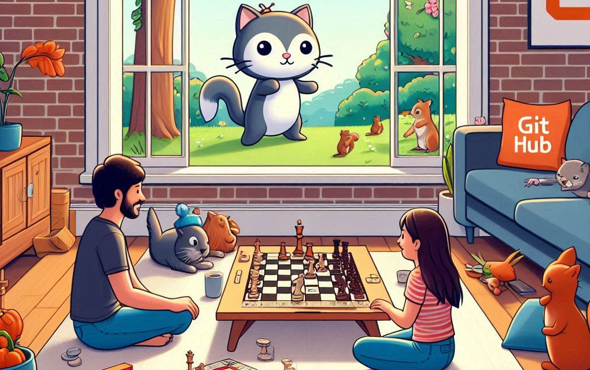

# 🎮 Game Collection by Jotis 🎮



## 🎯 Objectives
The objective of this project is to create a collection of classic games using Python and Pygame. The games included in this collection are:
- 🐍 Snake Game
- 🏓 Pong Game
- 👾 Space Invaders

## 🕹️ Functionality

### 🐍 Snake Game
Control the snake using the arrow keys. Eat the green food to grow the snake and increase your score. The game ends if the snake collides with the walls or itself.

#### Controls
- Arrow keys: Move the snake

#### Features
- Dynamic snake growth
- Score display
- Game over message

#### Code Structure
- **[`snake_game.py`](snake_game.py)**: Contains the code for the Snake Game.
  - `our_snake(snake_block, snake_list)`: Draws the snake on the screen.
  - `message(msg, color)`: Displays a message on the screen.
  - `your_score(score)`: Displays the current score.
  - `gameLoop()`: Main game loop handling game logic and events.

### 🏓 Pong Game
Play against the computer. Use the up and down arrow keys to control your paddle. The game ends when the ball goes out of bounds.

#### Controls
- Up arrow key: Move paddle up
- Down arrow key: Move paddle down

#### Features
- AI-controlled opponent
- Score display
- Game over message

#### Code Structure
- **[`pong_game.py`](pong_game.py)**: Contains the code for the Pong Game.
  - `message(msg, color)`: Displays a message on the screen.
  - `gameLoop()`: Main game loop handling game logic and events.

### 👾 Space Invaders
Control the spaceship using the left and right arrow keys. Shoot the enemies by pressing the space bar. The game ends when the enemies reach the bottom of the screen.

#### Controls
- Left arrow key: Move spaceship left
- Right arrow key: Move spaceship right
- Space bar: Shoot

#### Features
- Multiple enemies
- Bullet firing
- Collision detection
- Score display
- Game over message

#### Code Structure
- **[`space_invaders.py`](space_invaders.py)**: Contains the code for the Space Invaders Game.
  - `player(x, y)`: Draws the player on the screen.
  - `enemy(x, y)`: Draws an enemy on the screen.
  - `fire_bullet(x, y)`: Fires a bullet from the player's position.
  - `isCollision(enemyX, enemyY, bulletX, bulletY)`: Checks for collisions between bullets and enemies.
  - `show_score(x, y)`: Displays the current score.
  - `game_over_text()`: Displays the game over message.

## 🛠️ Tools Used
- **🐍 Python**: The main programming language used for the development of the games.
- **🎮 Pygame**: A set of Python modules designed for writing video games. It includes computer graphics and sound libraries.

## 🏗️ Development Process
1. **📝 Planning**: Defined the objectives and scope of the project.
2. **⚙️ Setup**: Installed Python and Pygame.
3. **💻 Implementation**: Developed each game individually, ensuring they are functional and bug-free.
4. **🧪 Testing**: Tested each game to ensure they work as expected.
5. **📄 Documentation**: Created this README file to document the project.

## 🗂️ Project Structure
- **[`main.py`](main.py)**: The main menu to select which game to play.
- **[`snake_game.py`](snake_game.py)**: Contains the code for the Snake Game.
- **[`pong_game.py`](pong_game.py)**: Contains the code for the Pong Game.
- **[`space_invaders.py`](space_invaders.py)**: Contains the code for the Space Invaders Game.
- **[`requirements.txt`](requirements.txt)**: Lists the dependencies required to run the project.
- **[`README.md`](README.md)**: This file, providing an overview of the project.

## 🤝 Collaborations
We welcome collaborations! If you would like to contribute to this project, please follow these steps:
1. 🍴 Fork the repository.
2. 🌿 Create a new branch (`git checkout -b feature-branch`).
3. ✏️ Make your changes.
4. 💾 Commit your changes (`git commit -m 'Add some feature'`).
5. 📤 Push to the branch (`git push origin feature-branch`).
6. 🔄 Open a pull request.

## 💡 Suggestions
We are open to suggestions! If you have any ideas on how to improve this project, please feel free to open an issue or contact us directly.

## 📞 Contact
If you have any questions or need further assistance, feel free to contact us:
- 📧 Email: jotaduranbon@gmail.com
- 💼 LinkedIn: [My LinkedIn Profile](www.linkedin.com/in/juan-duran-bon)

## 🚀 How to Run
1. Clone the repository:
    ```sh
    git clone https://github.com/Jotis86/Classic-games-collection.git
    ```
2. Navigate to the project directory:
    ```sh
    cd Classic-games-collection
    ```
3. Install the dependencies:
    ```sh
    pip install -r requirements.txt
    ```
4. Run the main menu:
    ```sh
    python main.py
    ```
5. Enjoy playing the games! 🎉

## 🛠️ Future Enhancements
We plan to add more features and improvements to the games in the future, including:
- Adding sound effects and background music
- Implementing different levels of difficulty
- Enhancing the graphics and animations
- Adding more classic games to the collection


## 🙏 Acknowledgements
We would like to thank the following resources and communities for their support and inspiration:
- [Pygame](https://www.pygame.org/) for providing the game development library
- [GitHub](https://github.com/) for hosting the project repository

## 📄 License

This project is licensed under the MIT License. See the [LICENSE](LICENSE) file for more details.
